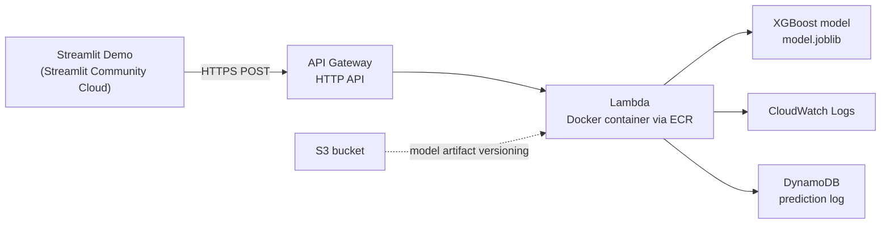

# ecommerce-fraud-triage-api

> **Status: Status: In progress — Phase 2 (API packaging and containerisation). Live demo and public endpoint will be linked here once deployment is complete.**

---

## What This Is

A real-time fraud triage service for card-not-present e-commerce transactions. Given a transaction's features, the API returns a binary flag (review / pass) and a calibrated probability score.

Built on the [IEEE-CIS Fraud Detection dataset](https://www.kaggle.com/c/ieee-fraud-detection) (Vesta Corporation via Kaggle, 2019): ~590,540 labeled transactions, 431 raw features across two joined tables, 3.5% fraud rate.

The output is framed as a **triage decision**, not a raw score. The classification threshold reflects the asymmetric cost of a missed fraud case versus the operational cost of a false-positive review — a business tradeoff, not a default 0.5 cutoff. See [Design Decisions](#design-decisions).

---

## Live Demo

> Not yet deployed. Link will appear here once Phase 4 (cloud deployment) is complete.

---

## Architecture



Inference runs entirely on AWS. The Streamlit frontend is hosted on Streamlit Community Cloud — deliberately separate to remove any AWS cost from the UI layer. See [Design Decisions](#design-decisions) for why Lambda + API Gateway over EC2 or SageMaker.

---

## Implementation Status

| Component | Status | Notes |
|---|---|---|
| Problem & dataset selection | ✅ Done | IEEE-CIS Fraud Detection; see `DECISIONS.md` |
| EDA & feature engineering | ✅ Done | `notebooks/01_eda.ipynb` |
| Leakage audit | ✅ Done | Part of EDA phase |
| Baseline model (logistic regression) | ✅ Done | Required comparison point for model justification |
| XGBoost classifier | ✅ Done | `RandomizedSearchCV` tuning; evaluated on PR-AUC |
| `scripts/preprocess.py` | ✅ Done | Reused at both training time and inference time |
| FastAPI inference endpoint | ✅ Done | `/predict` + `/health` |
| Docker containerisation | 🔲 In Progress | Targets `public.ecr.aws/lambda/python:3.11` directly |
| AWS billing alert + IAM user | ✅ Done | Set before any cloud resource is created |
| ECR image push | 🔲 Planned | Phase 4 |
| Lambda function (container image) | 🔲 Planned | Phase 4 |
| API Gateway HTTP API | 🔲 Planned | Phase 4 |
| S3 model artifact storage | 🔲 Planned | Phase 4 |
| Streamlit demo | 🔲 Planned | Phase 5; hosted on Streamlit Community Cloud |
| DynamoDB prediction logging | 🔲 Planned | Phase 7 |
| GitHub Actions CI/CD | 🔲 Stretch goal | Phase 6; redeploys Lambda on push to `main` |
| Automated drift detection | ❌ Not built | See `DECISIONS.md` — what I'd build next and why |

---

## Design Decisions

Full reasoning in [`DECISIONS.md`](./DECISIONS.md). Key choices summarised:

**Dataset — IEEE-CIS over ULB or PaySim**
ULB features are pre-PCA-transformed: no interpretable inputs, no real engineering decisions, demo is meaningless. PaySim is synthetic simulator output — fails the real-world data requirement. IEEE-CIS is real, genuinely messy (hundreds of sparse columns, a two-table join with partial identity coverage), and includes interpretable fields (transaction amount, card network, device type, email domain) that make a business-framed demo possible.

**Evaluation metric — PR-AUC and F1 on the minority class, not accuracy**
At 3.5% fraud rate, predicting "not fraud" on everything scores 96.5% accuracy. Precision and recall on the fraud class are the only metrics that say anything useful about model performance on the task that matters.

**Lambda + API Gateway over EC2 or SageMaker**
AWS free-tier accounts created post-mid-2025 receive a credit balance (~$100–200) that expires after six months. EC2 and SageMaker draw down that balance. Lambda, API Gateway, DynamoDB, and S3 sit on AWS's permanent Always Free allowances — this architecture keeps the project live indefinitely after the credits expire, not just for six months.

**Classical ML (XGBoost) over deep learning**
Keeps the model artifact in the tens-of-MB range, avoids Lambda cold-start pain from loading large models, and requires real feature engineering decisions rather than delegating representation learning to a network.

---

## Run Locally

```bash
git clone https://github.com/Abhinav-Tadi/ecommerce-fraud-triage-api.git
cd ecommerce-fraud-triage-api

python3 -m venv venv
source venv/bin/activate  # Windows: venv\Scripts\activate

pip install -r requirements-dev.txt

# Run the API server (after Phase 2 — model and app are built):
uvicorn app.main:app --reload --port 8000

# Predict endpoint:
curl -X POST http://localhost:8000/predict \
  -H "Content-Type: application/json" \
  -d '{"TransactionAmt": 150.0, "ProductCD": "W", "card4": "visa", ...}'

# Health check:
curl http://localhost:8000/health
```

> Full feature schema is documented in `app/schema.py`, added in Phase 2. The dataset must be downloaded separately from Kaggle — it is not included in this repository.

---

## What I'd Build Next

1. **Automated drift detection** — a scheduled Lambda that runs weekly, compares the distribution of logged prediction inputs against the training distribution (TransactionAmt, device type, card network), and alerts on statistically significant shift. Currently not built; the architecture for it is documented in `DECISIONS.md`.
2. **Least-privilege IAM** — current IAM policies are broader than necessary for simplicity. A production version would scope permissions to exactly what each service requires.
3. **Infrastructure as code** — current deployment uses AWS Console + CLI. Terraform or CloudFormation would make the setup reproducible, reviewable, and transferable.

---

## Tech Stack

Python · XGBoost · scikit-learn · FastAPI · Pydantic · Docker · AWS Lambda · ECR · API Gateway · S3 · DynamoDB · CloudWatch · Streamlit · GitHub Actions (planned)

---

## Dataset

IEEE-CIS Fraud Detection — [kaggle.com/c/ieee-fraud-detection](https://www.kaggle.com/c/ieee-fraud-detection)
~590,540 transactions · 431 features (train_transaction + train_identity join) · 3.5% fraud rate
Provided by Vesta Corporation via the IEEE Computational Intelligence Society.
