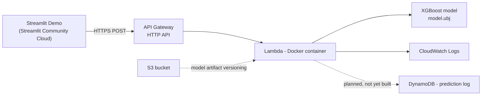

# E-Commerce Fraud Triage API

## Live Demo

**[Try it live →](https://ecommerce-fraud-triage-api-f47dpfknvoth67u5b8hcoy.streamlit.app/)** — calls a real XGBoost model deployed on AWS Lambda behind API Gateway. No local model, no mock data.

## What This Is

A real-time fraud-triage API for card-not-present e-commerce transactions, trained on the IEEE-CIS Fraud Detection dataset (~590,540 transactions, 3.5% fraud rate, Vesta Corporation via Kaggle). An XGBoost classifier (PR-AUC 0.8691, 422 features) scores each transaction and flags it for manual review rather than returning a bare probability, at an operating threshold tuned for ~85% recall / 67% precision based on the asymmetric cost of a missed fraud (chargeback + lost goods) versus a false alarm (one manual review). The model is packaged as a Dockerized FastAPI service running on AWS Lambda behind API Gateway; the Streamlit frontend is hosted separately on Streamlit Community Cloud to keep the entire UI layer off AWS billing.

Live API endpoint: `https://8456ksu3u8.execute-api.us-east-1.amazonaws.com/predict`. See "Test the Live Endpoint" below for copy-pasteable examples, including deliberately malformed and invalid requests.

---

## Architecture


```mermaid
flowchart LR
    A["Streamlit Demo\n(Streamlit Community Cloud)"] -->|HTTPS POST| B["API Gateway\nHTTP API"]
    B --> C["Lambda - Docker container"]
    C --> D["XGBoost model\nmodel.ubj"]
    C --> E["CloudWatch Logs"]
    C -.->|planned, not yet built| F["DynamoDB - prediction log"]
    G["S3 bucket"] -.->|model artifact versioning| C
```

Inference runs on AWS. The Streamlit frontend runs on Streamlit Community Cloud — keeping it off AWS entirely removes any billing risk from the UI layer.

---

## Build Status

| Component | Status | Notes |
|---|---|---|
| Problem & dataset selection | ✅ Done | IEEE-CIS Fraud Detection; see DECISIONS.md |
| EDA & feature engineering | ✅ Done | notebooks/01_eda.ipynb |
| Leakage audit | ✅ Done | Run during EDA; TransactionID and time-index confirmed clean |
| Baseline model (logistic regression) | ✅ Done | PR-AUC 0.4393 |
| XGBoost classifier | ✅ Done | PR-AUC 0.8691, 422 features, threshold 0.0957 |
| scripts/preprocess.py | ✅ Done | Same code path used at training time and inference time; case-insensitive categorical matching hardened pre-deployment — see DECISIONS.md |
| FastAPI inference endpoint | ✅ Done | /predict + /health; TransactionAmt validated as strictly positive at the schema layer (Field(gt=0)) — see DECISIONS.md |
| Test suite (tests/test_preprocess.py) | ✅ Done | 20 tests, pytest; categorical encoding, case sensitivity, schema-level type bridging, case-sensitive-column bool bridging, and TransactionAmt positivity validation all covered |
| Docker containerisation | ✅ Done | linux/arm64, Python 3.12 base image; provenance/SBOM disabled for Lambda compatibility — see DECISIONS.md |
| AWS billing alert (Phase 3) | ✅ Done | $1 budget alert configured before any resource was created |
| IAM user — abhinavtadi-dev (Phase 3) | ✅ Done | Scoped policies; root account not used for day-to-day work |
| ECR image push | ✅ Done | Single-manifest image, arm64, verified via `docker manifest inspect` |
| Lambda function | ✅ Done | arm64, 1769MB/60s — see DECISIONS.md for cold-start sizing rationale |
| API Gateway HTTP API | ✅ Done | Live: `https://8456ksu3u8.execute-api.us-east-1.amazonaws.com/predict` |
| S3 model artifact storage | ✅ Done | s3://fraud-triage-model-179265444220/model/ — model.ubj, model_config.json, category_maps.json |
| Streamlit demo (demo/streamlit_app.py) | ✅ Done | Live at https://ecommerce-fraud-triage-api-f47dpfknvoth67u5b8hcoy.streamlit.app/ — confirmed against the real AWS endpoint, including a post-deployment stress test |
| Demo test suite (demo/test_streamlit_app.py) | ✅ Done | 16 tests: pytest + Streamlit AppTest. Network calls mocked for 15 of them; one explicit opt-in test (`RUN_LIVE_ENDPOINT_TEST=1`) hits the live endpoint directly |
| DynamoDB prediction logging | ❌ Not built | Deprioritized given dissertation timeline — see "What I'd Do Next" |
| GitHub Actions CI/CD | ❌ Not built | Deprioritized given dissertation timeline — see "What I'd Do Next" |
| Automated drift detection | ❌ Not built | Design documented in DECISIONS.md; not automated in v1 |

---

## Key Design Decisions

Full reasoning in [DECISIONS.md](./DECISIONS.md). Short version:

**Dataset — IEEE-CIS over ULB or PaySim**
ULB is already PCA-transformed. The inputs are anonymous components, not transaction fields, which makes a real inference API pointless — you can't build a business-framed demo when you can't explain what the features mean. PaySim is synthetic. IEEE-CIS has real transactions with interpretable fields and a genuinely annoying join problem (75.6% of transactions have no matching identity record at all). That messiness is what makes it worth working through.

**Evaluation metric — PR-AUC, not accuracy**
At 3.5% fraud rate, predicting "not fraud" every single time gets you 96.5% accuracy. Precision and recall on the fraud class are the only numbers that say anything useful here.

**Lambda over EC2**
AWS accounts created after mid-2025 get a credit balance that expires after six months. EC2 draws it down. Lambda, API Gateway, DynamoDB, and S3 all sit on AWS's permanent Always Free tier. The project stays live indefinitely.

**XGBoost over deep learning**
41MB artifact, native NaN handling, no GPU needed. A deep learning model would have tripled cold-start latency and required GPU infrastructure for no meaningful accuracy gain on a tabular dataset this size.

**Demo exposes ~8 fields out of the model's 422 — deliberately, not as a shortcut**
The two highest-importance features (V258, V201 — 33.3% combined) are Vesta's undisclosed, non-human-interpretable behavioral signals. No browser-facing form can meaningfully set them, so the demo is upfront in its own UI about what it can and can't demonstrate, rather than pretending 8 legible fields tell the whole story. A post-deployment stress test confirmed this empirically: pushing the amount field across four orders of magnitude moved the model's underlying score by only ~3 units of log-odds.

---

## Run Locally

### Run the API

```bash
git clone https://github.com/Abhinav-Tadi/ecommerce-fraud-triage-api.git
cd ecommerce-fraud-triage-api

python3 -m venv venv
source venv/bin/activate

pip install -r requirements-dev.txt

uvicorn app.main:app --reload --port 8000
```

Test it:

```bash
# Minimal valid request (TransactionAmt is the only required field)
curl -X POST http://localhost:8000/predict \
  -H "Content-Type: application/json" \
  -d '{"TransactionAmt": 150.0}'

# With card and product fields
curl -X POST http://localhost:8000/predict \
  -H "Content-Type: application/json" \
  -d '{"TransactionAmt": 500.0, "ProductCD": "C", "card4": "discover", "card6": "credit", "P_emaildomain": "anonymous.com"}'

# Health check
curl http://localhost:8000/health

# Should return 422 — TransactionAmt is missing
curl -X POST http://localhost:8000/predict \
  -H "Content-Type: application/json" \
  -d '{"card4": "visa"}'

# Should return 422 — TransactionAmt must be strictly positive
curl -X POST http://localhost:8000/predict \
  -H "Content-Type: application/json" \
  -d '{"TransactionAmt": -5000}'
```

Run the API test suite:

```bash
pytest tests/test_preprocess.py -v
```

The dataset isn't in this repo — download from [Kaggle](https://www.kaggle.com/c/ieee-fraud-detection) and place in `data/` to re-run training.

### Run the Streamlit demo

```bash
cd demo
pip install -r requirements.txt
streamlit run streamlit_app.py
```

Opens at `http://localhost:8501` and calls the live AWS endpoint above directly — no local model, no mock data. Run the demo's test suite with:

```bash
pytest test_streamlit_app.py -v                              # 15 tests, no network needed
RUN_LIVE_ENDPOINT_TEST=1 pytest test_streamlit_app.py -v      # adds a real call to the live endpoint
```

---

## Test the Live Endpoint

Same requests, against the actual deployed AWS infrastructure instead of a local server:

```bash
# Minimal valid request
curl -X POST https://8456ksu3u8.execute-api.us-east-1.amazonaws.com/predict \
  -H "Content-Type: application/json" \
  -d '{"TransactionAmt": 150.0}'

# Deliberately malformed — TransactionAmt is required, this omits it
curl -i -X POST https://8456ksu3u8.execute-api.us-east-1.amazonaws.com/predict \
  -H "Content-Type: application/json" \
  -d '{"card4": "visa"}'
# Expect a clean 422 with a Pydantic validation body, not a 500

# Deliberately invalid — TransactionAmt must be strictly positive
curl -i -X POST https://8456ksu3u8.execute-api.us-east-1.amazonaws.com/predict \
  -H "Content-Type: application/json" \
  -d '{"TransactionAmt": -5000}'
# Expect: {"detail":[{"type":"greater_than","msg":"Input should be greater than 0",...}]}
```

---

## What I'd Do Next

- **CI/CD** — a GitHub Actions workflow (build → push to ECR → update Lambda on every push to `main`). Explicitly skipped for v1 given the dissertation deadline. Every deploy so far has instead been a manual, verified CLI/console sequence — slower, but it's what surfaced the arm64/provenance/manifest gotchas documented in DECISIONS.md; a working pipeline built too early might have papered over them instead of forcing me to understand each one.
- **Prediction logging & drift detection** — a DynamoDB table logging each request (input, prediction, probability, timestamp), plus a scheduled Lambda comparing the last 7 days of logged inputs against the training distribution (KS test or PSI, alert via SNS past a threshold). Neither is built; both are explicit time cuts, not oversights — full design in DECISIONS.md.
- **Least-privilege IAM** — current policies are broader than they need to be, and didn't even cover everything needed (creating the Lambda execution role required a one-time root-console exception, confirmed via CloudTrail — see DECISIONS.md). Fine for a portfolio project, would tighten and complete before anything touched production.
- **Infrastructure as code** — Phase 4 was done via AWS CLI and console, step by step. It worked, but surfaced real gotchas that IaC would catch earlier or avoid entirely (a shell-quoting bug that silently corrupted image tags twice, a Lambda-incompatible manifest format from Docker's default build behavior). Terraform or CDK would make this reproducible, version-controlled, and less exposed to this class of manual-process error.

---

## Tech Stack

Python · XGBoost · scikit-learn · FastAPI · Pydantic · Docker · AWS Lambda · ECR · API Gateway · S3 · CloudWatch · Streamlit

---

## Dataset

[IEEE-CIS Fraud Detection](https://www.kaggle.com/c/ieee-fraud-detection) — Vesta Corporation via Kaggle, 2019. ~590,540 transactions, 3.5% fraud rate.